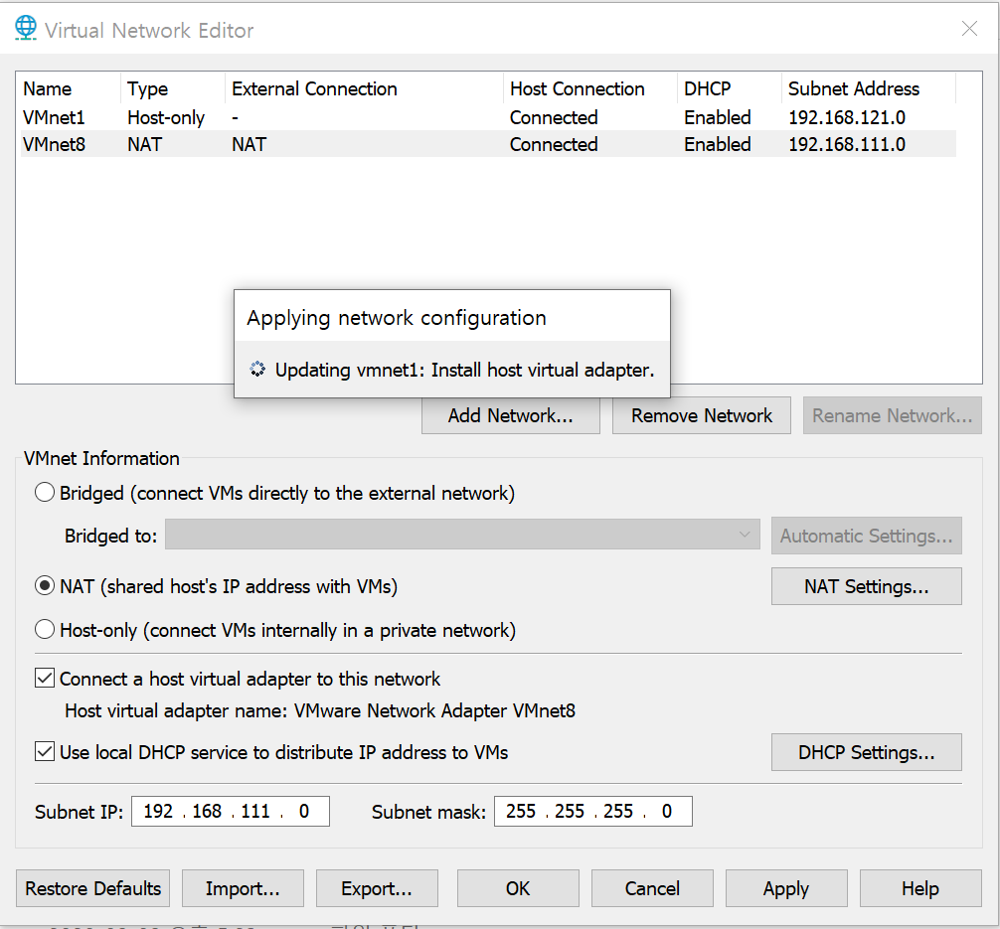

> 수업 시간에 배운 LINUX 설정 방법과 각 상황에서 일어난 문제 대처법

# VMWare 설치

1. [VMWARE](https://www.filehorse.com/download-vmware-player/44878/) 접속
2. **VMware-player-15.5.1-15018445.exe** 파일 다운로드
3. **c:/LINUX** 디렉토리로 설정 **(아니면 내일 삭제)**
4. [카페](https://cafe.naver.com/multiiot2020) 게시판에서 **vmnetcfg_15_5_1.zip** 다운로드
5. [Centos](https://www.centos.org/centos-linux/) 에서 **CentOS-7-x86_64-DVD-2003.iso** 다운로드
6. [P51] Network Setting(vmnetcfg 파일을 VMWare Server 디렉토리 안에 복사)
   * C:\Program Files (x86)\VMware\VMware Player
   * Network Setting은 _고정 IP 환경_을 만들기 위해

7. vmnetcfg 실행 후 아래와 같이 설정




# LINUX 설치 & 설정

## HOME

1. Create a New Virtual Machine

   * **Installer disc image file(iso):** 체크 후 Browse에서 설치받은 Centos 선택 
   * C:\Users\user\Downloads\CentOS-7-x86_64-DVD-2003.iso
   * Location은 **c:\Linux\name**, 'name'은 자유이나 Location과 같게 헷갈리지 않는다.
   * disk size는 용도에 맞게 정하고 **Store virtual disk as a single file** 선택

2. Edit virtual machine settings

   * memory, Processors 설정
   * Network Adapter에서 Advanced 들어가 Mac Adress를 Generate

   

### 실행 후 세팅

1. 언어&날짜&시간을 **한국**으로 세팅

2. 네트워크 및 호스트 이름 ==> **"켬"** 으로 변경

3. 소프트웨어 선택 ==> **개발 및 창조를 위한 워크스테이션**

4. 설치 목적지

   * Automatic -> Custom(파티션 선택) 후 위에 있는 것 선택하고 완료

   * 표준 파티션 선택 후 `+` 를 클릭하면 새 마운트 지점 추가가 나온다

   * swap에 4Gb 할당하고 표준 파티션으로 변경,

     다시 `+`를 클릭하고 마운트 지점에 `/`를 적은 후 표준 마운트 지점 추가하고 표준 파티션으로 변경

5. 설치 시작 !

6. Root 암호 설정(111111), 사용자 설정(centos, 111111) 하고 기다린다

7. 라이센스 동의 후 설정완료

8. **한국어(Hangul)**로 선택, Hangul이 없다면 한국어 선택하면 된다

9. 위에서 root를 설정했으므로 아이디 비밀번호 대충 만들고 나중에 바꾸자~ 실행!


### root 접속 후 세팅

1. _장치 -> 디스플레이_에서 해상도 설정

2. _개인정보 -> 화면잠금_에서 전부 "끔"으로 설정

3. _전원 -> 절전_에서 "안함"으로 설정

4. _지역 및 언어_에서 한국어(Hangul)을 제외한 모두를 `-`로 삭제

   * `shift + space`로 한/영 전환 가능

5. ifconfig로 아이피 확인 후,

   * cd /etc/sysconfig/network-scripts

   * gedit ifcfg-ens33 에서 (내가 한건 왜 32?) 

     ```java 
     BOOTPROTO="dhcp" 를
         
     BOOTPROTO="none"
     IPADDR="192.168.111.101"
     NETMASK="255.255.255.0"
     GATEWAY="192.168.111.2"
     DNS1="192.168.111.2"  으로 변경
     ```

   * systemctl restart network 후 ifconfig 로 아이피 확인

6. 자동 업데이트를 방지하기 위해

   * gedit /etc/yum.repos.d/CentOS-Base.repo

   * [updates] 부분을 전부 삭제한다

7. 보안 설정 해제를 위해

   * gedit /etc/sysconfig/selinux

   * SELINUX=disable 로 설정한다.

8. 방화벽을 해제한다

   * systemctl stop firewalld 로 멈추고
   * systemctl disable firewalld 로 재부팅해도 동작하지 않게 한다
   * systemctl status firewalld 로 확인


### 위 기본설정이 이미 완료된 LINUX 복제

1. Linux가 설치된 directory를 **복사**한다.
2. directory **이름을 변경**한다.
3. vmx 파일을 열어 **displayName**을 원하는 이름으로 변경한다.
4. vmware에서 **"Open Virtual Machine"** 후 해당 폴더의 VMX 선택
5. **Edit Virtual Machine setting**에 들어가 **Network Adapter**에서 **Advanced** 클릭 후 **Mac Address**를 Generate로 변경
6. 중간에 뜨는 popup 창에서 반드시 **"I moved it"** 선택 !
7. PLAY ~~ !
   * 복제한 LINUX server 들어가 반드시 **ip 설정!**


## 필요한 파일 다운로드

### JDK 8u261 [링크](https://www.oracle.com/kr/java/technologies/javase/javase-jdk8-downloads.html)

* download jdk-8u261-linux-x64.tar.gz
* cd 다운로드
* tar xvf jdk-8u261-linux-x64.tar.gz
* mv jdk1.8.0.11.11 jdk1.8.0
* cp -r jdk1.8.0 /usr/local
* cd /usr/bin
* rm java ==> 심볼릭 링크 삭제 'y'
* ln -s /usr/local/jdk1.8.0/bin/java java
* vi /etc/profile 들어가서 **:set nu**로 **52라인**
* JAVA_HOME=/usr/local/jdk1.8.0
  CLASSPATH=/usr/local/jdk1.8.0/lib
  export JAVA_HOME CLASSPATH
  PATH=$JAVA_HOME/bin:$PATH:.


### ECLIPSE [링크](https://www.eclipse.org/downloads/packages/)

* Eclipse IDE for Enterprise Java Developers에서 Linux 64-bit
* cd 다운로드
* tar xvf eclipse-xxx.gz
* cp -r eclipse /usr/local
* cd /usr/bin
* ln -s /usr/local/eclipse/eclipse eclipse


### TOMCAT [링크](tomcat.apache.org)

* tomcat 9에서 Core 아래에 있는 tar.gz 다운로드
* tar xvf apache-tomcat-9.0.38.tar.gz
* cp -r apache-tomcat-9.0.38  /usr/local
* cd /usr/local/apache-tomcat-9.0.38/conf
* vim server.xml 에서 69line에 있는 Port를 8080-->80 변경
* cd /usr/bin
  * ln -s /usr/local/apache-tomcat-9.0.37/bin/startup.sh starttomcat
  * ln -s /usr/local/apache-tomcat-9.0.37/bin/shutdown.sh stoptomcat


### ORACLE [링크](https://www.oracle.com/database/technologies/xe-prior-releases.html) (내일 페이지로 적은 부분 적기)

* firefox에서 Oracle Database 11gR2 Express Edition for Linux x64 다운로드
* cd  다운로드
* unzip oracle-xe-11.2.0-1.0.x86_64.rpm.zip
* cd Disk1
* yum -y localinstall oracle-xe-11.2.0-1.0.x86_64.rpm
  * localinstall은 직접 다운로드한 파일을 exe파일처럼 실행
* service oracle-xe configure 입력
  * 포트번호,SQL*PLUS 접속 포트번호에서 엔터를 눌러주고 암호 입력 후 엔터
  * y로 시작 설정하면 끝난다
* systemctl restart oracle-xe
* systemctl status oracle-xe
* . /u01/app/oracle/product/11.2.0/xe/bin/oracle_env.sh 입력
* 재부팅 후에도 설정 적용될 수 있도록  gedit /etc/bashrc의 맨 밑에 위 글을 작성한다


#### 웹에서 ORACLE 접속	

* 192.168.111.xxx:8080/apex에 접속해서 [Workspace : internal], [Username : admin], [Password : service ~에서 지정한 비밀번호(111111)]를 입력한다
* 비밀번호를 바꾸라는 화면에서 그대로 111111 입력 후 다시 로그인
* Create Workspace에서 Workspace, Username, password 설정(이메일은 대충 써도 됨)
  * Schema name, password라고 써있다고 당황하지 말기 !
* Logout 후 방금 생성한 것으로 로그인
* SQL Workshop -> SQL Commands 에 들어가서 작업

#### 윈도우에서 Oracle Developer 

* Oracle Developer 다운로드
* jdk가 포함된 버전으로 다운로드
* 실행이 안된다면 Windows32에서 msvcr100.dll 가져다가 programfiles/java/jdk/jre/bin에 넣어주기


### MariaDB [링크](https://downloads.mariadb.com/MariaDB/mariadb-10.0.15/yum/centos7-amd64/rpms/) 

1. 링크에서 common, server, client 다운로드

2. yum -y remove mariadb-libs로 기존 파일 삭제

   yum -y localinstall Maria* 로 다운로드

3. systemctl restart mysql

   systemctl status mysql

4. chkconfig mysql on

5. mysqladmin -u root password '111111'

   mysql -h localhost -u root -p

   USE mysql;

6. GRANT ALL ON *.* TO hive@'%' IDENTIFIED BY '111111';

   * '%'에는 192.168.111.xxx, hostname 등 필요한 것 넣기

7. CREATE DATABASE hive_db;

   USE hive_db; 

#### MariaDB 오류 해결법

1. **systemctl   stop  mysql**

2. **yum -y  remove Maria* **

3. **cd 다운로드** 에서 mariadb 관련 파일과 폴더를 삭제한다

4. rm -rf /etc/my.cnf*
   rm -rf /var/log/mysql  

   rm -rf /var/lib/mysql

5. 다운로드를 처음부터 다시 시작한다


* Eclipse와 연결할 때는 [네이버 카페](https://cafe.naver.com/multiiot2020)에서 **mariadb-java-client-1.3.5.jar**을 다운로드 받고, 

* ```java
  Class.forName("org.mariadb.jdbc.Driver");
  String dbUrl = "jdbc:mariadb://localhost:3306/shopdb";
  string dbUser = "username";
  string dbPasswd = "passwd";
  Connection conn = DriverManager.getConnection(dbUrl, dbUser, dbPasswd);
  ```

* 방식으로 작성하여 연결한다.


### FTP

* vsftpd 설치

  * yum -y install vsftpd

* systemctl restart vsftpd

  systemctl enable vsftpd

* vim /etc/vsftpd/vsftpd.conf

  * line 19,29,33 에 # 제거
  * 35에 ftpd_banner=Welcome!!!! (안해도 됨)

* chown ftp.ftp /var/ftp/pub

  * ftp.ftp에 권한을 줌

* systemctl restart vsftpd

* window client program 설치

  * 알드라이브 설치
  * 192.168.111.xxx , 익명 으로 접속
